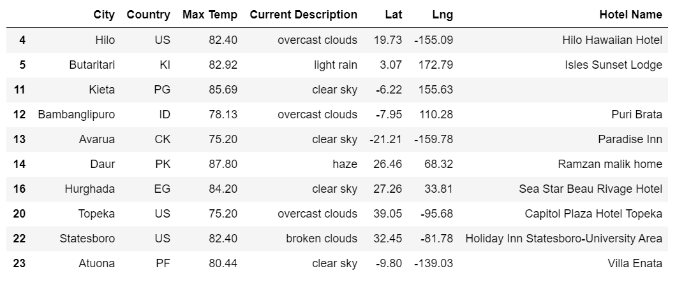

# World_Weather_Analysis
Find the best cities to vacation using weather using weather map API and mapbox.

### Part 1: Get the Weather Description and Amount of Precipitation for Each City
* We used numpy random function to get 1500 latitude and longitude upper and lower limit was defied by latitude and longitudes uppper and lower limit.
* After getting valuesw for latitude and longitude used WeatherMapAPI request using API key to get the information about the cities for latitude and logitude created in above step.
* Saved above created DataFram into WeatherPy_database.csv.

### Part 2: Have Customers Narrow Their Travel Searches Based on Temperature and Precipitation
* Got the information from WeatherPy_database.csv and converted into DataFrame
* Asked cutomer for information to narrow down the search like: min temp, max temp, raning , snowing etc. From customer input created new data frame.

* Used above dataframe information and google map API to locate hotels and created hotel dataframe also saved data into csv.

* Using new information and info box created gmaps marker layer which showd popups for hotels.

### Part 3: Create a Travel Itinerary with a Corresponding Map
* Used information created for hotels in part 2's csv and asked customer to input 4 destination cities. 
* Collected information for latitude and longitude for input cities using panadas datatframe.
* Created gmaps directions layer using DRIVING option.

* Added all those four cities information into one dataframe and created marker layer gmap with popups for hotels.

